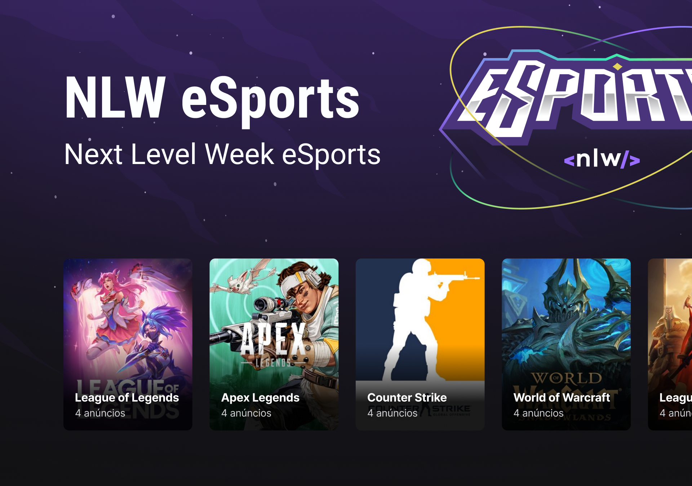

<p align="center">
    
</p>

<h1 align="center">Next Level Week eSports</h1>

<div align="center">

[](https://www.linkedin.com/in/guilhermesandi/)

<p align="center">
    
</p>

</div>

<br>

## ✨ Tecnologias

-   [ ] React
-   [ ] Typescript
-   [ ] Tailwind CSS
-   [ ] Radix

## 🚀 Como usar

```
1- Clone esse repositório

2- Vá no diretório raiz do repositório

3- Instale as dependências:
$ yarn install

4- Inicie a aplicação:
$ yarn dev
```

## 📄 Licença

Esse projeto está sob a licença MIT. Veja o arquivo [LICENSE](LICENSE) para mais detalhes.
